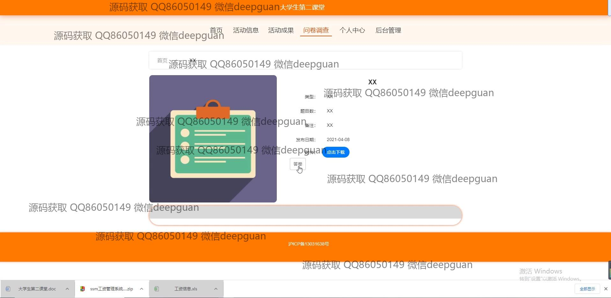

<h1 align="center">大学生第二课堂学分成绩活动报名vue</h1>

## 简介
大学生第二课堂管理系统：角色分为管理员、用户；功能模块包括活动报名、成绩管理、活动信息管理、成果管理、问卷管理等，支持灵活的活动成绩查询和用户信息管理。    --计算机毕业设计源码；毕设源码；java毕业设计源码

## 联系方式

<h3 align="center">获取完整代码与数据库文件 + 微信：deepguan QQ: 86050149 QQ群: 783742310</h3>

<h3 align="center">可帮忙远程部署 包运行成功！提供远程部署、修改代码、设计文档指导、代码讲解等服务！</h3>

## 功能介绍（完整见运行截图）
管理员：基本功能包括登录、注册和退出系统。系统允许管理员管理学生信息、活动信息及成绩，通过模块如学生管理、专业管理、活动信息管理等进行操作。管理员可以添加、编辑及删除活动类型和活动信息，并管理学分录入和活动成果。在密码修改页面，可以输入原密码和新密码进行密码修改。此外，系统支持查看管理学生活动报名、成果及成绩，并提供搜索功能以便高效管理。页面设计简洁，用户体验友好。

用户：用户主要功能包括登录、注册和退出。用户可以通过系统查看个人中心信息、参与活动报名、查看活动成果及学分成绩等。在活动信息页面，用户能够查看活动类型、举办单位、时间和地点等详细信息，并通过报名按钮进行活动参与。在修改密码页，用户可以通过输入当前密码和新密码来更新账号密码。系统设计直观，用户可以方便地浏览记录的学生活动信息及参与问卷调查。

## 运行截图

本代码来源于网络,仅供学习参考使用!

